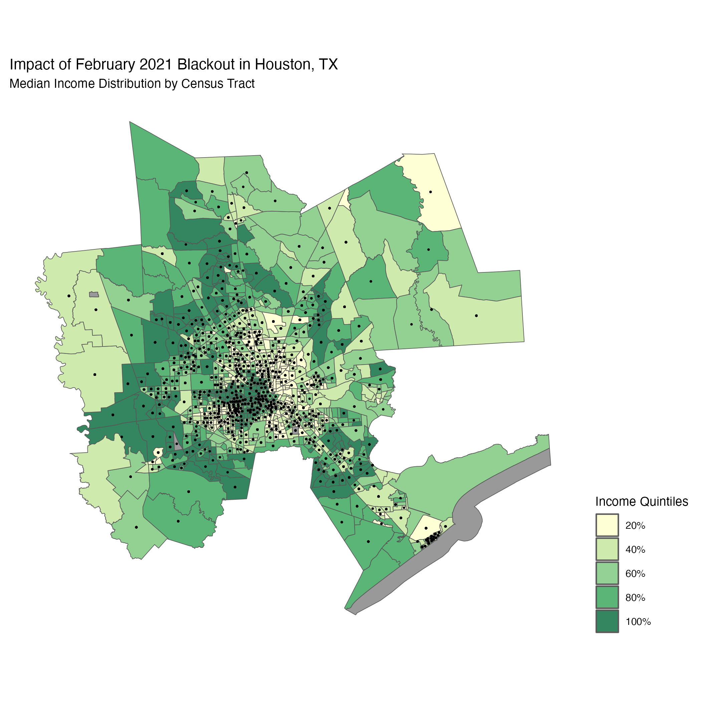
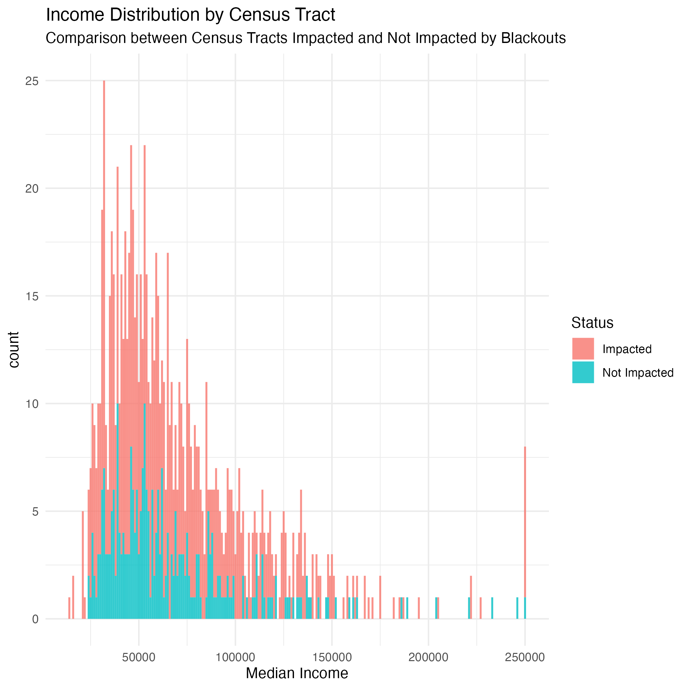

# Analysis of the Socio-Economic Disparities During the Texas Electric Grid Blackout in 2021

<p align="center">
   
</p>

# Table of Contents {#table-of-contents}

-   [Project Title](#project-title)
-   [Quickstart/Demo](#quickstartdemo)
-   [Table of Contents](#table-of-contents)
-   [Installation](#installation)
-   [File structure](#file-structure)
-   [Data](#data)
-   [Usage](#usage)
-   [Contribute](#contribute)
-   [License](#license)

# Installation {#installation}

[(Back to top)](#table-of-contents)

Repository:

``` shell
https://github.com/oksanaprotsukha/texas-grid-blackout-2021.git
```

The analysis is written in R-language. The following tools are required
to rerun the analysis: - R-ready environment (Rstudio, VSCode) - The
data is not included in the repo due ot its size. Instead, it can be
downloaded data from
[here](https://drive.google.com/file/d/1bTk62xwOzBqWmmT791SbYbHxnCdjmBtw/view?usp=sharing).

# File structure {#file-structure}

[(Back to top)](#table-of-contents)

```         
texas-grid-blackout-2021
│   README.md
│   Rmd/Proj files    
│
└───data
    │   gis_osm_buildings_a_free_1.gpkg
    │   gis_osm_roads_free_1.gpkg
    │
    └───ACS_2019_5YR_TRACT_48_TEXAS.gdb
    |   │   census tract gdb files
    |
    └───VNP46A1
    |   │   VIIRS data files
```

# Data {#data}

[(Back to top)](#table-of-contents)

The analysis is based on four datasets.

#### Dataset 1: Night Lights (VIIRS data)

Visible Infrared Imaging Radiometer Suite (VIIRS) data of Houston, TX
from 2021-02-07 and 2021-02-16 from NASA's [Level-1 and Atmospheric
Archive & Distribution System Distributed Active Archive Center (LAADS
DAAC)](https://ladsweb.modaps.eosdis.nasa.gov/)

**Note**: Many NASA Earth data products are distributed in 10x10 degree
tiles in sinusoidal equal-area projection. Tiles are identified by their
horizontal and vertical position in the grid. Houston lies on the border
of tiles h08v05 and h08v06, requiring the analysis of two tiles for each
day.

Processed data is available in `VNP46A1` folder.\

-   `VNP46A1.A2021038.h08v05.001.2021039064328.h5.tif`: tile h08v05,
    collected on 2021-02-07\
-   `VNP46A1.A2021038.h08v06.001.2021039064329.h5.tif`: tile h08v06,
    collected on 2021-02-07\
-   `VNP46A1.A2021047.h08v05.001.2021048091106.h5.tif`: tile h08v05,
    collected on 2021-02-16\
-   `VNP46A1.A2021047.h08v06.001.2021048091105.h5.tif`: tile h08v06,
    collected on 2021-02-16

#### Dataset 2: Roads (shapefiles)

A Geopackage (`.gpkg` file) containing just the subset of roads that
intersect the Houston metropolitan area. Source data: [Geofabrik's
download sites](https://download.geofabrik.de/)

-   `gis_osm_roads_free_1.gpkg`

#### Dataset 3: Houses (shapefiles)

A Geopackage (`.gpkg` file) containing only houses in the Houston
metropolitan area. Source data: [Geofabrik's download
sites](https://download.geofabrik.de/)

-   `gis_osm_buildings_a_free_1.gpkg`

#### Dataset 4: Socioeconomic (ArcGIS)

Data from the [U.S. Census Bureau's American Community
Survey](https://www.census.gov/programs-surveys/acs) for census tracts
in 2019.

The *folder* `ACS_2019_5YR_TRACT_48.gdb` is an ArcGIS ["file
geodatabase"](https://desktop.arcgis.com/en/arcmap/latest/manage-data/administer-file-gdbs/file-geodatabases.htm),
a multi-file proprietary format that's roughly analogous to a GeoPackage
file.\

[ACS
metadata](https://www2.census.gov/geo/docs/maps-data/data/tiger/prejoined/ACSMetadata2011.txt).\

# Usage {#usage}

[(Back to top)](#table-of-contents) This repo can be used to reproduce
and contribute to the analysis.

# Contribute {#contribute}

[(Back to top)](#table-of-contents) Use issues to contribute to the
project:

``` shell
https://github.com/oksanaprotsukha/texas-grid-blackout-2021/issues/new/choose
```

# License {#license}

[(Back to top)](#table-of-contents)

[MIT license](./LICENSE)
